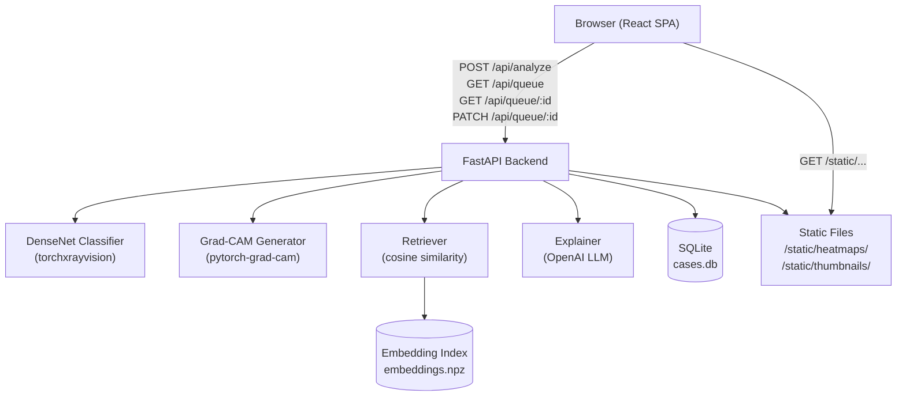
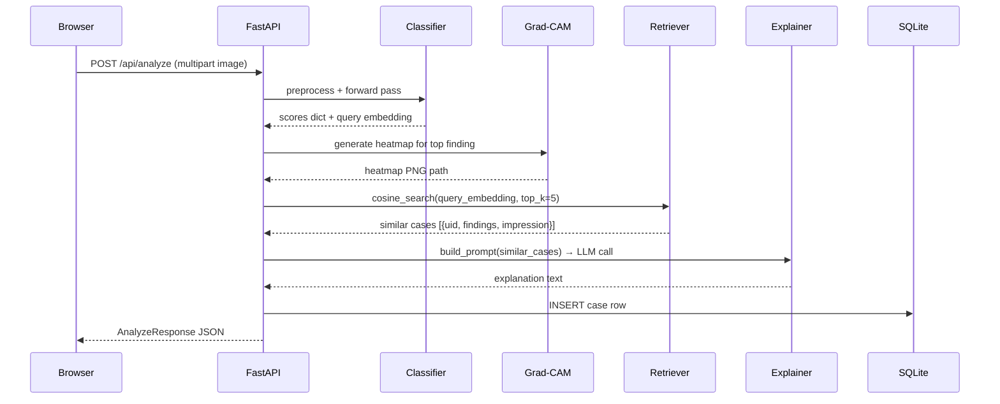

# Design Document: Chest X-Ray Triage

## Overview

A full-stack research prototype that accepts chest X-ray uploads, runs them through a pretrained DenseNet classifier (torchxrayvision `densenet121-res224-all`), overlays a Grad-CAM heatmap on the result, retrieves similar historical cases via offline-indexed cosine similarity, generates a grounded natural-language explanation via an LLM, and surfaces everything in a triage queue with priority lanes.

The system is scoped to a 1-day build. No model training, no authentication, no production deployment config. All inference runs on CPU. The prototype disclaimer is embedded in every API response and every UI view.

### Technology Stack

| Layer | Choice |
|---|---|
| Frontend | React (Vite), React Router, Recharts for the score chart |
| Backend | FastAPI (Python), Uvicorn |
| ML inference | torchxrayvision, PyTorch (CPU) |
| Grad-CAM | pytorch-grad-cam |
| Embeddings | NumPy `.npz` index (offline), cosine similarity at query time |
| LLM | OpenAI Chat Completions API (gpt-4o-mini) via `openai` SDK |
| Persistence | SQLite via `sqlite3` stdlib (no ORM) |
| Image I/O | Pillow (PIL) |

---

## Architecture



### Request Lifecycle — POST /api/analyze



---

## Components and Interfaces

### Backend

#### `app/main.py` — FastAPI application entry point
- Mounts `/static` directory for heatmaps and thumbnails
- Registers routers: `analyze`, `queue`
- Loads the Classifier singleton at startup via `lifespan` context

#### `app/classifier.py` — Classifier + feature extractor
```python
def load_model() -> xrv.models.DenseNet
    """Load densenet121-res224-all once at startup."""

def run_inference(model, img_array: np.ndarray) -> dict[str, float]:
    """Return {label: probability} for all 18 pathology labels."""

def get_query_embedding(model, img_array: np.ndarray) -> np.ndarray:
    """Extract the 1024-d feature vector before the classifier head."""
```

#### `app/gradcam.py` — Heatmap generation
```python
def generate_heatmap(
    model, img_tensor: torch.Tensor, target_label_idx: int, original_pil: Image
) -> str:
    """
    Run GradCAM on model.features (last conv block).
    Overlay jet colormap at 0.5 alpha onto original image.
    Save to static/heatmaps/{uuid}.png.
    Return relative URL path.
    """
```
- Target layer: `model.features` (the DenseNet feature block)
- Uses `pytorch_grad_cam.GradCAM` with `ClassifierOutputTarget`

#### `app/retriever.py` — Embedding index + cosine search
```python
def load_index(path: str = "data/embeddings.npz") -> tuple[np.ndarray, list[dict]]:
    """Load embedding matrix and metadata list from .npz."""

def cosine_search(
    query: np.ndarray, embeddings: np.ndarray, metadata: list[dict], k: int = 5
) -> list[dict]:
    """Return top-k metadata dicts sorted by cosine similarity."""
```

#### `app/explainer.py` — LLM grounded explanation
```python
def build_prompt(query_scores: dict, similar_cases: list[dict]) -> str:
    """Construct a few-shot prompt using retrieved report text as context."""

def get_explanation(prompt: str) -> str:
    """Call OpenAI Chat Completions (gpt-4o-mini) and return explanation text."""
```
- If `OPENAI_API_KEY` is unset or the call fails, returns a graceful fallback string (no crash).

#### `app/db.py` — SQLite persistence
```python
def init_db(db_path: str = "cases.db") -> None:
    """Create cases table if not exists."""

def insert_case(conn, case: dict) -> int:
    """Insert a case row and return the new id."""

def get_queue(conn, status: str | None) -> list[dict]:
    """Return cases filtered by status, sorted priority DESC then created_at ASC."""

def get_case(conn, case_id: int) -> dict | None:
    """Return full case row or None."""

def update_case_status(conn, case_id: int, status: str) -> bool:
    """Set status field; return False if row not found."""
```

#### `app/priority.py` — Priority + escalation logic
```python
def compute_priority(scores: dict[str, float]) -> str:
    """Return 'High' if any score > 0.7, else 'Normal'."""

def needs_human_review(scores: dict[str, float]) -> bool:
    """
    Return True if:
      - top-2 score difference <= 0.15, OR
      - both top-2 scores < 0.4
    """
```

#### `app/routers/analyze.py` — POST /api/analyze
- Receives multipart `file`
- Validates MIME type (image/jpeg or image/png); returns 422 on invalid
- Orchestrates: preprocess → inference → heatmap → retrieval → explanation → DB insert
- Returns `AnalyzeResponse`

#### `app/routers/queue.py` — Queue endpoints
- `GET /api/queue?status=pending|reviewed|needs_human_review`
- `GET /api/queue/{id}`
- `PATCH /api/queue/{id}` body `{"status": "reviewed"}`

#### `scripts/build_index.py` — Offline indexer
```python
# Joins indiana_projections.csv + indiana_reports.csv on uid
# Filters projection == "Frontal"
# For each image: PIL.open(path) → preprocess → get_query_embedding
# Saves embeddings.npz: {"embeddings": (N,1024), "metadata": json-serialized list}
```
- Images opened with `PIL.Image.open()` regardless of `.dcm` extension (they contain PNG bytes)

---

### Frontend

#### Route structure
```
/               → UploadView
/result/:id     → ResultView
/queue          → QueueView
```

#### `UploadView`
- File drag-and-drop + click-to-select (accept `.jpg,.jpeg,.png`)
- Inline image preview via `URL.createObjectURL`
- Client-side MIME type validation; inline error for non-image files
- Loading spinner while awaiting `POST /api/analyze`
- On success: navigate to `/result/:id`

#### `ResultView`
- Fetches `GET /api/queue/:id`
- Toggle button: "Original" / "Heatmap" — swaps `` src
- Bar chart of all finding scores (Recharts `BarChart`)
- Similar cases panel (accordion or list)
- Grounded explanation text block with disclaimer label
- "Mark Reviewed" button → `PATCH /api/queue/:id`

#### `QueueView`
- Fetches `GET /api/queue` (all statuses or filtered)
- Two-lane layout: "Needs Review" lane (status=`needs_human_review`) + main priority lane
- Client-side sort by priority or timestamp (no page reload)
- Case card: thumbnail, top finding, confidence badge, priority chip, timestamp
- Click card → navigate to `/result/:id`

#### `Disclaimer` (global component)
- Persistent banner at top of every view: "Research prototype — not for clinical use"

---

## Data Models

### SQLite `cases` table

```sql
CREATE TABLE IF NOT EXISTS cases (
    id            INTEGER PRIMARY KEY AUTOINCREMENT,
    filename      TEXT    NOT NULL,
    top_finding   TEXT    NOT NULL,
    top_score     REAL    NOT NULL,
    findings_json TEXT    NOT NULL,   -- JSON-serialized {label: score} dict
    heatmap_path  TEXT    NOT NULL,   -- relative URL, e.g. /static/heatmaps/abc.png
    thumbnail_path TEXT   NOT NULL,   -- relative URL, e.g. /static/thumbnails/abc.png
    priority      TEXT    NOT NULL,   -- 'High' | 'Normal'
    status        TEXT    NOT NULL DEFAULT 'pending',
    -- 'pending' | 'reviewed' | 'needs_human_review'
    created_at    TEXT    NOT NULL    -- ISO-8601 UTC
);
```

> Note: `thumbnail_path` is added beyond the requirements spec column list to allow the QueueView card to display a thumbnail without re-fetching the full image.

### API Schemas (Pydantic)

```python
class FindingScore(BaseModel):
    label: str
    score: float          # 0.0–1.0

class SimilarCase(BaseModel):
    uid: str
    findings: str | None
    impression: str | None
    similarity: float

class AnalyzeResponse(BaseModel):
    id: int
    filename: str
    top_finding: str
    top_score: float
    findings: list[FindingScore]
    heatmap_url: str
    thumbnail_url: str
    priority: str          # 'High' | 'Normal'
    status: str            # 'pending' | 'needs_human_review'
    similar_cases: list[SimilarCase]
    explanation: str
    disclaimer: str
    created_at: str

class CaseSummary(BaseModel):
    id: int
    filename: str
    top_finding: str
    top_score: float
    thumbnail_url: str
    priority: str
    status: str
    created_at: str

class CaseDetail(AnalyzeResponse):
    pass  # same shape; convenience alias

class StatusUpdate(BaseModel):
    status: Literal["reviewed"]
```

### Embedding Index (`data/embeddings.npz`)

```
embeddings  : float32 array, shape (N, 1024)
metadata    : object array of JSON strings, shape (N,)
              each item: {"uid": str, "findings": str|null, "impression": str|null, "image_path": str}
```

---


## Correctness Properties

*A property is a characteristic or behavior that should hold true across all valid executions of a system — essentially, a formal statement about what the system should do. Properties serve as the bridge between human-readable specifications and machine-verifiable correctness guarantees.*

### Property 1: Inference output validity

*For any* valid image array passed to `run_inference`, the returned dict must contain at minimum the keys `Pneumonia`, `Effusion`, and `No Finding`, and every score value must be in the range [0.0, 1.0].

**Validates: Requirements 2.1**

---

### Property 2: Invalid file type rejection

*For any* uploaded file whose MIME type is not `image/jpeg` or `image/png`, the frontend validation must reject it and no HTTP request must be sent to the backend.

**Validates: Requirements 1.3**

---

### Property 3: Heatmap file is created for the top finding

*For any* valid image tensor and scores dict, calling `generate_heatmap` with the index of the highest-scoring label must produce a file at the returned path that is a readable image (non-zero byte length, openable by PIL).

**Validates: Requirements 3.1, 3.2**

---

### Property 4: Retrieval returns k sorted results with required fields

*For any* query embedding and non-empty embedding index, `cosine_search` must return exactly `min(k, N)` results, ordered strictly descending by cosine similarity, where each result contains `uid`, `findings`, `impression`, and `similarity` fields, and every `similarity` value is in [-1.0, 1.0].

**Validates: Requirements 4.2, 4.3**

---

### Property 5: Prompt contains all retrieved report text

*For any* non-empty list of similar cases and any scores dict, the string returned by `build_prompt` must contain the `impression` text (when non-null) from every case in the input list.

**Validates: Requirements 5.1**

---

### Property 6: Case persistence round-trip

*For any* completed analyze call that returns a case `id`, retrieving that case via `get_case(id)` must return a row whose `top_finding`, `top_score`, `priority`, `status`, and `findings_json` fields match the values computed during analysis.

**Validates: Requirements 6.1, 7.1, 7.3**

---

### Property 7: Queue filter returns only matching-status cases in correct order

*For any* database state containing cases with mixed statuses, calling `get_queue(status=S)` must return only rows where `status == S`, sorted such that `High` priority cases precede `Normal` priority cases, and within the same priority, cases are ordered by `created_at` ascending.

**Validates: Requirements 7.2**

---

### Property 8: Mark-reviewed removes case from pending view

*For any* case currently in `pending` status, after calling `update_case_status(id, "reviewed")`, a call to `get_queue(status="pending")` must not include that case, and `get_queue(status="reviewed")` must include it.

**Validates: Requirements 6.7**

---

### Property 9: compute_priority assigns High iff any score exceeds 0.7

*For any* dict of finding scores, `compute_priority` must return `"High"` if and only if at least one score value is strictly greater than 0.7; otherwise it must return `"Normal"`.

**Validates: Requirements 6.2**

---

### Property 10: needs_human_review triggers on ambiguous or low-confidence scores

*For any* dict of finding scores with at least two entries, `needs_human_review` must return `True` if and only if either (a) the absolute difference between the top-1 and top-2 scores is ≤ 0.15, or (b) both the top-1 and top-2 scores are strictly less than 0.4.

**Validates: Requirements 6.3**

---

### Property 11: Client-side sort produces a correctly ordered list

*For any* array of case objects, sorting by priority must place all `High` cases before all `Normal` cases; sorting by timestamp must produce a list where each case's `created_at` is ≤ the next case's `created_at`.

**Validates: Requirements 6.5**

---

### Property 12: Indexer output contains findings and impression for every Frontal row

*For any* pair of fixture CSVs joined on `uid` and filtered to `projection == "Frontal"`, every entry in the resulting metadata array must have `findings` and `impression` fields drawn from the corresponding `indiana_reports.csv` row.

**Validates: Requirements 8.1, 8.3**

---

### Property 13: Disclaimer is present in every analyze response

*For any* successful `POST /api/analyze` call, the returned JSON must contain a non-empty `disclaimer` field whose value includes the phrase "not for clinical use".

**Validates: Requirements 9.2**

---

## Error Handling

| Scenario | Backend Behavior | Frontend Behavior |
|---|---|---|
| Non-image file uploaded | Router returns HTTP 422 with `detail` | Inline error below drop zone; no spinner |
| File too large (>10 MB) | Router returns HTTP 413 | Inline error message |
| Inference runtime error | Returns HTTP 500 with `{"detail": "<message>"}` | Toast/alert with error text |
| Embedding index missing | Backend logs warning; `similar_cases: []`, `explanation: ""` | ResultView shows "No similar cases found" |
| OpenAI API key missing or call fails | `get_explanation` returns fallback string; no crash | Explanation field shows fallback text with disclaimer |
| Case id not found (GET/PATCH) | Returns HTTP 404 | ResultView shows "Case not found" error state |
| DB write failure | Returns HTTP 500 | Toast error |
| Image cannot be decoded by PIL | Returns HTTP 422 with descriptive message | Inline error message |

**Fallback explanation text** (when LLM unavailable):
> "Automated explanation unavailable. Please review the finding scores and similar cases directly. Research prototype — not for clinical use."

---

## Testing Strategy

### Dual Testing Approach

Both unit tests and property-based tests are required. They are complementary:

- **Unit tests** verify specific examples, edge cases, integration points, and error conditions.
- **Property-based tests** verify universal correctness across randomized inputs, catching edge cases that examples miss.

### Property-Based Testing

**Library**: [`hypothesis`](https://hypothesis.readthedocs.io/) (Python, backend) and [`fast-check`](https://fast-check.dev/) (TypeScript/JavaScript, frontend).

Each property-based test must run a minimum of **100 iterations** and be tagged with a comment referencing the design property:

```python
# Feature: chest-xray-triage, Property 9: compute_priority assigns High iff any score exceeds 0.7
@given(scores=st.dictionaries(st.text(min_size=1), st.floats(0.0, 1.0), min_size=1))
def test_compute_priority_property(scores):
    result = compute_priority(scores)
    if max(scores.values()) > 0.7:
        assert result == "High"
    else:
        assert result == "Normal"
```

```typescript
// Feature: chest-xray-triage, Property 11: Client-side sort produces a correctly ordered list
fc.assert(fc.property(fc.array(caseArbitrary), (cases) => {
  const sorted = sortCases(cases, "priority");
  // all High before Normal
  ...
}), { numRuns: 100 });
```

### Property Test Map

| Property | Test File | PBT Library |
|---|---|---|
| P1: Inference output validity | `tests/test_classifier.py` | hypothesis |
| P2: Invalid file type rejection | `src/__tests__/upload.test.ts` | fast-check |
| P3: Heatmap file created | `tests/test_gradcam.py` | hypothesis |
| P4: Retrieval returns k sorted results | `tests/test_retriever.py` | hypothesis |
| P5: Prompt contains report text | `tests/test_explainer.py` | hypothesis |
| P6: Case persistence round-trip | `tests/test_db.py` | hypothesis |
| P7: Queue filter + sort | `tests/test_db.py` | hypothesis |
| P8: Mark-reviewed removes from pending | `tests/test_db.py` | hypothesis |
| P9: compute_priority | `tests/test_priority.py` | hypothesis |
| P10: needs_human_review | `tests/test_priority.py` | hypothesis |
| P11: Client-side sort | `src/__tests__/queue.test.ts` | fast-check |
| P12: Indexer metadata fields | `tests/test_indexer.py` | hypothesis |
| P13: Disclaimer in response | `tests/test_api.py` | hypothesis |

### Unit Tests

Unit tests focus on specific examples, edge cases, and integration points that properties don't cover:

- **Upload flow**: valid image triggers `POST /api/analyze` (1.2)
- **Preview rendered**: selecting a file sets preview src (1.1)
- **Loading indicator**: shown while request is in-flight (1.4)
- **Inference error → HTTP 500**: simulate `model.forward` throwing (2.4)
- **Heatmap toggle**: clicking toggle swaps image src (3.3)
- **Similar cases panel rendered**: ResultView shows report text (4.4)
- **Explanation disclaimer label**: "AI-generated prototype output" text present (5.4)
- **Queue two-lane layout**: needs_human_review cases in separate lane (6.4)
- **Case navigation**: clicking queue card navigates to ResultView (6.6)
- **HTTP 404 on unknown id**: `GET /api/queue/99999` returns 404 (7.4)
- **PIL opens .dcm as PNG**: open fixture .dcm file, verify PIL returns Image (8.2)
- **Disclaimer on all views**: render UploadView, QueueView, ResultView and assert disclaimer text (9.1)

### Test Configuration Notes

- Backend: `pytest` + `hypothesis`, `pytest-anyio` for async routes, in-memory SQLite for DB tests
- Frontend: `vitest` + `@testing-library/react` + `fast-check`
- Each hypothesis test uses `settings(max_examples=100)` at minimum
- The indexer test uses a small fixture dataset (5 rows) rather than the full IU corpus
- Inference tests use a fixture 224×224 grayscale image array (random noise) to avoid requiring the full model weights in CI; model-loading tests are marked `@pytest.mark.slow`
