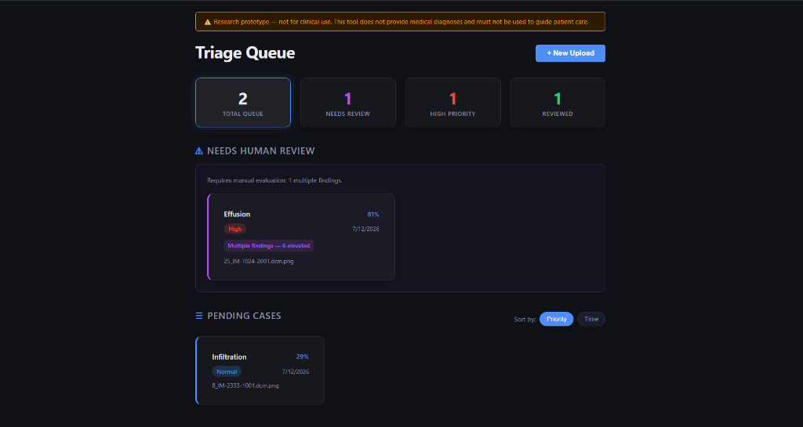
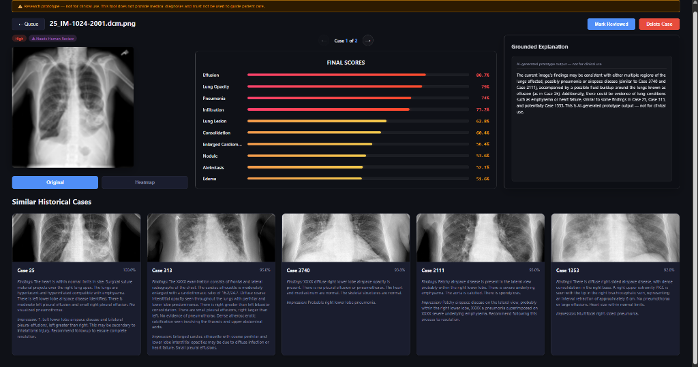
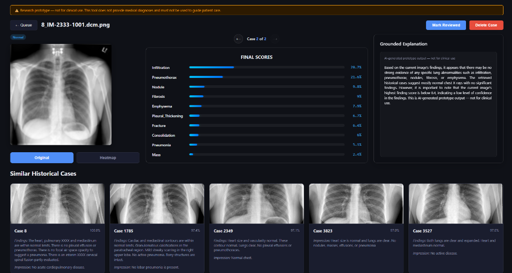
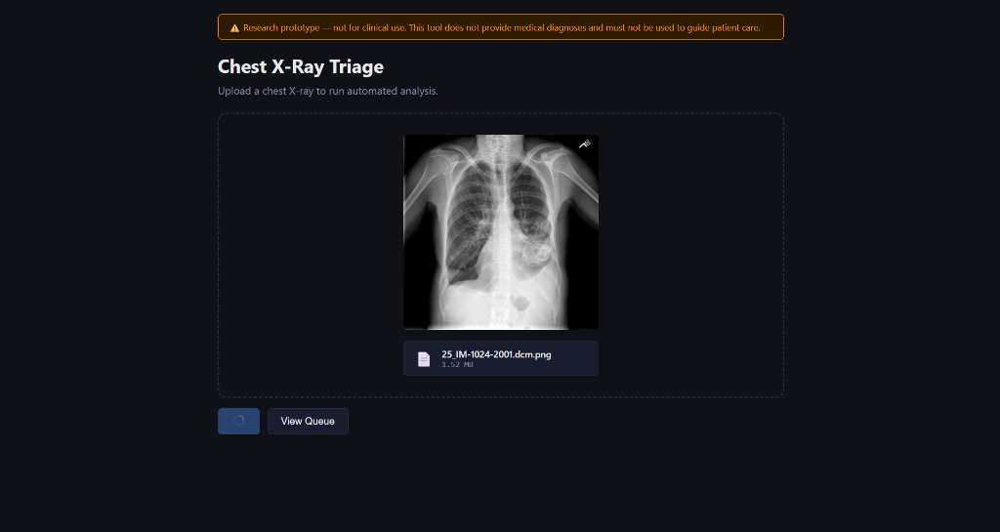

# Chest X-Ray Triage — Research Prototype

> ⚠️ **This is a research prototype, NOT a diagnostic tool.**
> It uses a general-purpose pretrained model and has not been validated for clinical use.
> Do not use it to guide patient care or clinical decisions.

A full-stack web app that lets you upload a chest X-ray, runs it through a pretrained
DenseNet classifier (torchxrayvision), overlays a Grad-CAM heatmap, retrieves similar
historical cases, and adds the result to a sortable triage queue.

---

## Stack

| Layer | Tech |
|---|---|
| Frontend | React + Vite + Recharts + React Router |
| Backend | FastAPI + Python 3.11 |
| ML | torchxrayvision DenseNet (`densenet121-res224-all`) |
| Explainability | pytorch-grad-cam |
| Retrieval | NumPy cosine similarity index |
| Explanation | OpenAI gpt-4o-mini (optional) |
| Persistence | SQLite |

---

## Screenshots

### 1. Triage Queue Dashboard

*The main dashboard features glassmorphic summary stats cards that act as interactive filters. Triage cases are organized into content-focused, text-only cards that wrap dynamically based on viewport dimensions.*

### 2. Diagnostic Case Detail (High Urgency & Human Review Escalation)

*A detailed analysis page for a high-priority case flagged for human review. It displays DenseNet pathology scores, a Grad-CAM heatmap overlay, similar historical cases from Indiana University, and a RAG-grounded clinician explanation.*

### 3. Diagnostic Case Detail (Routine Normal Priority Case)

*A routine case with a clear explanation, low findings score distribution, and relative historical cases.*

### 4. Interactive File Upload Panel

*The drag-and-drop diagnostic entry point with live client-side MIME validation and queue access.*

---

## Setup

### 1. Create and activate the conda environment

```bash
conda create -n cxr python=3.11 -y
conda activate cxr
pip install -r requirements.txt
# PyTorch CPU build
pip install torch==2.5.1 torchvision==0.20.1 --index-url https://download.pytorch.org/whl/cpu
```

### 2. Install frontend dependencies

```bash
npm install
```

### 3. (One-time) Build the embedding index

This runs every Frontal image from the IU Chest X-ray dataset through the model's feature
layer and saves `data/embeddings.npz`. Required before retrieval will work.

```bash
conda run -n cxr python scripts/build_index.py
```

This takes several minutes on CPU (≈3,600 Frontal images). Progress is printed every 100 images.

---

## Running the app

**Backend** (in one terminal):

```bash
conda activate cxr
uvicorn app.main:app --reload --port 8000
```

**Frontend** (in another terminal):

```bash
npm run dev
```

Then open [http://localhost:5173](http://localhost:5173).

---

## Environment variables

| Variable | Required | Description |
|---|---|---|
| `OPENAI_API_KEY` | Optional | Enables grounded LLM explanations via OpenAI. Without it, the app falls back to a local Ollama model. |

### Local Ollama fallback

If `OPENAI_API_KEY` is not set, the backend automatically tries a local [Ollama](https://ollama.com)
instance. To enable it:

```bash
# 1. Install Ollama: https://ollama.com/download
# 2. Pull the model (one-time, ~5 GB):
ollama pull mistral
# 3. Start the backend normally — Ollama is detected automatically
```

If Ollama is also unavailable, a static fallback message is shown and the app continues without crashing.

The `explanation_source` field in the API response (`"openai"` / `"ollama"` / `"unavailable"`)
shows which path was used.

Set it before starting the backend:

```bash
export OPENAI_API_KEY=sk-...   # Linux/macOS
set OPENAI_API_KEY=sk-...      # Windows CMD
$env:OPENAI_API_KEY="sk-..."   # Windows PowerShell
```

---

## Running tests

**Backend:**
```bash
conda run -n cxr python -m pytest
```

**Frontend:**
```bash
npx vitest --run
```

---

## How It Works & Design Rationale

### Classification
The triage pipeline begins with image classification using a pretrained DenseNet model trained on multiple large chest X-ray datasets. For any input image, the model outputs a probability score between 0 and 1 for each of 18 clinical findings (such as Pneumonia, Effusion, Infiltration, etc.). These scores represent the model's feature-level confidence in the presence of each finding, rather than a clinical diagnosis.

### Grad-CAM Explainability
To prevent the model's confidence scores from acting as a black-box, the app integrates Grad-CAM (Gradient-weighted Class Activation Mapping). This technique projects gradient information from the final convolutional layer back onto the input image, producing a visual heatmap overlay. This heatmap highlights the exact regions where the model detected the key visual patterns for its top-scoring finding. A clinician can instantly verify if the model is focusing on a genuine pathological area or simply reacting to image noise, anatomical variations, or medical implants.

### Retrieval-Grounded Explanation (RAG)
Rather than relying on an LLM to generate clinical reasoning from scratch, the system uses a retrieval-augmented generation (RAG) approach. First, the query chest X-ray is passed through the DenseNet model to extract a dense 1024-dimensional feature vector from the average pooling layer. This vector is compared via cosine similarity against a precomputed index of 3,689 historical cases from the Indiana University Chest X-ray dataset. The top-k most similar cases are retrieved, and their corresponding radiologist-written findings and impressions are extracted. These real-world clinical reports are then supplied to the LLM as grounding context. This design choice ensures that the generated summary is strictly anchored in historical clinical precedents, preventing the hallucination of non-existent pathology.

### Triage Queue Sorting Logic
The application employs structured rules to organize the triage queue lanes, ensuring cases are prioritized safely and consistently:
*   **Priority Assignment (`compute_priority`):** A case is marked as **High** priority if any single finding probability score exceeds `0.7`. Otherwise, it is assigned **Normal** priority.
*   **Human Escalation Heuristic (`needs_human_review`):** Cases are routed to the **Needs Human Review** lane if either of two conditions is met:
    *   *Low Confidence:* The single highest finding score is between `0.4` and `0.6` (inclusive), indicating that the model's best guess is highly uncertain.
    *   *Multiple Findings:* Two or more findings score above `0.6`, indicating the presence of concurrent pathologies.
    These are tracked as distinct, independent escalation reasons ("Low confidence" vs "Multiple findings") and shown dynamically as subtext next to each case in the UI to give clinicians immediate context for the review flag.
*   **Sorting Order:** Within both the "Needs Human Review" and routine lanes, cases are sorted by **Priority** (High before Normal), and by **Timestamp ascending** within the same priority. This ensures that the oldest, most critical cases are always presented at the top of the queue.
*   **Safety Rationale:** The core purpose of this escalation design is to ensure the model does not silently decide ambiguous or complex cases. By isolating cases with boundary-level scores or multiple concurrent pathologies, the triage queue proactively demands human clinical correlation rather than presenting a falsely confident classification.

### Scope & Limitations
This project demonstrates an approach to AI-assisted medical imaging triage — it is not a solution intended for real clinical use as-is. It is built entirely on a publicly available research dataset (Indiana University Chest X-ray Collection) and a general-purpose pretrained model, not validated against any hospital's real patient population or equipment. It has no regulatory clearance, no patient data compliance infrastructure (e.g. HIPAA/DPDP), and no clinical sign-off workflow. Any real-world adoption path would require clinical validation, regulatory approval, and hospital-specific data — this project is a demonstration of the underlying design patterns (explainable classification, retrieval-grounded reasoning, human-escalation logic), not a deployable product.

---

## Dataset

Uses the [IU Chest X-ray dataset](https://www.kaggle.com/datasets/raddar/chest-xrays-indiana-university).
Place files at:

```
data/indiana_projections.csv
data/indiana_reports.csv
data/images/images_normalized/   ← image files (PNG bytes despite .dcm extension)
```

---

## Features

- **Upload**: Drag-and-drop or file picker; client-side MIME validation
- **Inference**: torchxrayvision DenseNet, 18 pathology labels, CPU inference
- **Grad-CAM**: Heatmap overlay on the top-scoring finding
- **Retrieval**: Cosine similarity over pre-built embedding index (top-5 similar cases)
- **Explanation**: RAG-grounded LLM summary from retrieved reports referencing cases by their unique database UIDs
- **Escalation**: Cases with ambiguous scores → distinct "Needs Human Review" queue lane
- **Priority**: High if max score > 0.7, else Normal (heuristic only)
- **Interactive Triage Queue**: Glassmorphic stats cards act as clickable filters to view specific lanes (Total, Needs Review, High Priority, and Reviewed cases).
- **Responsive Card Grid Layout**: Content-focused, text-only cards that wrap automatically across screen widths to avoid horizontal scrolling.
- **Queue Navigation**: Circular navigation controls within details view to step through active or reviewed cases contextually without leaving the page.

---

## Technical Limitations & Caveats

- CPU inference only; single-image latency is several seconds
- The model (`densenet121-res224-all`) is trained on a mix of public datasets; performance on out-of-distribution images is unknown
- Priority and escalation thresholds are hardcoded heuristics
- LLM explanations are grounded in retrieved text but remain AI-generated and unverified
- No authentication or multi-user support

---

## Clinical Disclaimer & Project Goals

> 💡 **Design Showcase & Educational Purpose Only**
> This project is **not approved for clinical use** and is not intended for diagnostic purposes. It was built as a research prototype to showcase design thinking in the healthcare industry—specifically, how human-in-the-loop workflows, explainable AI components (Grad-CAM), and retrieval-grounded LLM summaries can be cohesive, user-friendly, and safe.
>
> Any actual clinical deployment would require:
> - Hospital-specific adjustments (calibration to local scanners, demographics, and clinical pathways).
> - Strict regulatory clearance and clinical validation trials.
> - Full integration with hospital systems (PACS/DICOM) and data privacy compliance (HIPAA/GDPR/DPDP).

---

## Data & Model Attribution

### Dataset
- **Name:** Indiana University Chest X-Ray Collection (also known as Open-I), sourced from the National Library of Medicine's Open-i service.
- **Citation:** Demner-Fushman D, Kohli MD, Rosenman MB, et al. "Preparing a collection of radiology examinations for distribution and retrieval." *J Am Med Inform Assoc*. 2016;23(2):304-310. PMID: 26133894.
- **Distribution:** Sourced from the Kaggle release by user "raddar" ([kaggle.com/datasets/raddar/chest-xrays-indiana-university](https://www.kaggle.com/datasets/raddar/chest-xrays-indiana-university)), which provides the same reports and images pre-processed into CSV and PNG formats.
- **Use Note:** All radiology reports and images in this dataset are de-identified and were released for open research use. This project uses them strictly for demonstration purposes, not for any commercial or clinical product.

### Model
- **Name:** `torchxrayvision` (specifically the `densenet121-res224-all` pretrained weights).
- **Citation:** Cohen JP, Viviano JD, et al. "TorchXRayVision: A library of chest X-ray datasets and models." (MIDL 2022 / arXiv). Repository: [github.com/mlmed/torchxrayvision](https://github.com/mlmed/torchxrayvision).
- **License:** Distributed under the **Apache License 2.0**.

